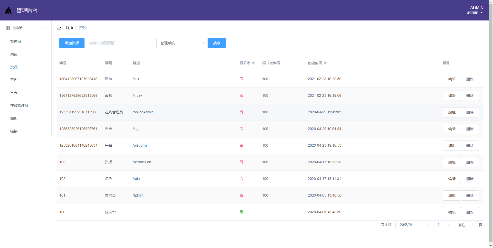

#  单表增删改查功能

#  数据库实现
```mysql
CREATE TABLE `chaos_index` (
  `id` int(11) unsigned NOT NULL AUTO_INCREMENT,
  `mu` varchar(64) NOT NULL,
  `version` int(11) NOT NULL DEFAULT '1',
  `is_delete` tinyint(2) NOT NULL DEFAULT '0',
  `modify_time` timestamp NOT NULL DEFAULT CURRENT_TIMESTAMP ON UPDATE CURRENT_TIMESTAMP,
  `create_time` timestamp NOT NULL DEFAULT '0000-00-00 00:00:00',
  PRIMARY KEY (`id`),
  UNIQUE KEY `inx_mu` (`mu`) USING BTREE
) ENGINE=InnoDB AUTO_INCREMENT=1 DEFAULT CHARSET=utf8 ROW_FORMAT=COMPACT;
```
#  服务端实现
```java
package com.firepongo.chaos.model.entity;

@Data
@NoArgsConstructor
@EqualsAndHashCode@Accessors(chain = true)
@TableName("chaos_index")
@ApiModel(value="ChaosIndex实体")
public class ChaosIndex extends MuModel {

}
```
```java
package com.firepongo.chaos.model.data;

@Data
@NoArgsConstructor
@Accessors(chain = true)
@EqualsAndHashCode
@ApiModel(value="ChaosIndexData")
public class ChaosIndexData extends DATA{

}
```
```java
package com.firepongo.chaos.service.mapper;

public interface ChaosIndexMapper extends BaseMapper<ChaosIndex> {

}
```

```xml
<mapper namespace="com.chaos.service.mapper.ChaosIndexMapper">

</mapper>
```
```java
package com.firepongo.chaos.model.service;

public interface IChaosIndexService extends IService<ChaosIndex> {
    MU insertModel(ChaosIndexData data);
    boolean deleteModel(MU data);
    boolean updateModelByMU(UpdateData<ChaosIndexData> data);
    ChaosIndexData selectByMU(MU data);
    List<ChaosIndexData> selectByData(ChaosIndexData data);
    PageList<ChaosIndexData> selectByPage(PageQueryDto<ChaosIndexData> pageData);
}
```
```java
package com.firepongo.chaos.service.impl;

@Slf4j
@Service(interfaceClass = IChaosIndexService.class)
@Component
public class ChaosIndexServiceImpl extends ServiceImpl<ChaosIndexMapper, ChaosIndex> implements IChaosIndexService {
    @Autowired
    private ConvertService convertService;

    @Override
    public MU insertModel(ChaosIndexData data) {
        ChaosIndex entity = (ChaosIndex) convertService.convertToMuModel(data, ChaosIndex.class);
        return save(entity) ? MU.of(entity.getMu()) : null;
    }

    @Override
    public boolean deleteModel(MU data) {
        return removeById(data.getMu());
    }

    @Override
    public boolean updateModelByMU(UpdateData<ChaosIndexData> data) {
        ChaosIndex entity = (ChaosIndex) convertService.convertToMuModel(data.getData(), ChaosIndex.class);
        return update(entity, new UpdateWrapper<ChaosIndex>().eq(Table.MU, data.getMu()));
    }

    @Override
    public ChaosIndexData selectByMU(MU data) {
        return (ChaosIndexData) convertService.convertToDTO(getOne(new QueryWrapper<ChaosIndex>()
                .eq(Table.MU, data.getMu())), ChaosIndexData.class);
    }

    @Override
    public List<ChaosIndexData> selectByData(ChaosIndexData data) {
        QueryWrapper<ChaosIndex> query = new QueryWrapper<ChaosIndex>();
        query.lambda().eq(!StringUtils.isEmpty(data.getMu()), ChaosIndex::getMu, data.getMu());
        query.orderByDesc(Table.ID);
        return convertService.convertToDTO(list(query), ChaosIndexData.class);
    }

    @Override
    public PageList<ChaosIndexData> selectByPage(PageQueryDto<ChaosIndexData> pageData) {
        QueryWrapper<ChaosIndex> query = new QueryWrapper<ChaosIndex>();
        query.lambda().eq(!StringUtils.isEmpty(pageData.getData().getMu()), ChaosIndex::getMu, pageData.getData().getMu());
        query.orderByDesc(Table.ID);
        return new PageList(page(PageHelper.page(pageData), query), ChaosIndexData.class);
    }

} 
```
```java
package com.firepongo.chaos.manager.controller;

@Slf4j
@Api(tags = "ChaosIndexController")
@RestController
@RequestMapping("/manage/chaosIndex")
public class ChaosIndexController extends BaseController {
    @Autowired
    private IChaosIndexService iChaosIndexService;

    @PostMapping("/add")
    @ManageLoginToken(roles = {RoleConstant.ADMIN, RoleConstant.DEV})
    @ApiOperation(value = "", httpMethod = "POST")
    public DataResult<MU> add(@RequestBody @Validated ChaosIndexData data, BindingResult bindingResult) throws Exception {
        validate(bindingResult);
        return dataResult(iChaosIndexService.insertModel(data));
    }

    @PostMapping("/update")
    @ManageLoginToken(roles = {RoleConstant.ADMIN, RoleConstant.DEV})
    @ApiOperation(value = "", httpMethod = "POST")
    public DataResult<Boolean> update(@RequestBody @Validated UpdateData<ChaosIndexData> data, BindingResult bindingResult) throws Exception {
        validate(bindingResult);
        return dataResult(iChaosIndexService.updateModelByMU(data));
    }

    @PostMapping("/one")
    @ManageLoginToken(roles = {RoleConstant.ADMIN, RoleConstant.DEV})
    @ApiOperation(value = "", httpMethod = "POST")
    public DataResult<ChaosIndexData> one(@RequestBody MU data) throws Exception {
        return dataResult(iChaosIndexService.selectByMU(data));
    }

    @PostMapping("/list")
    @ManageLoginToken(roles = {RoleConstant.ADMIN, RoleConstant.DEV})
    @ApiOperation(value = "", httpMethod = "POST")
    public DataResult<List<ChaosIndexData>> list(@RequestBody ChaosIndexData data) throws Exception {
        return dataResult(iChaosIndexService.selectByData(data));
    }

    @PostMapping("/page")
    @ManageLoginToken(roles = {RoleConstant.ADMIN, RoleConstant.DEV})
    @ApiOperation(value = "", httpMethod = "POST")
    public PageResult<ChaosIndexData> page(@RequestBody PageQueryDto<ChaosIndexData> data) throws Exception {
        return pageResult(iChaosIndexService.selectByPage(data));
    }

    @PostMapping("/delete")
    @ManageLoginToken(roles = {RoleConstant.ADMIN, RoleConstant.DEV})
    @ApiOperation(value = "", httpMethod = "POST")
    public DataResult<Boolean> delete(@RequestBody MU data) throws Exception {
        return dataResult(iChaosIndexService.deleteModel(data));
    }

}

```
#  前端实现
```vue
<template>
    <el-container>
        <el-header>
            <el-container>
                <PrimaryButton text="增加" :click="showAdd"/>
                <SearchInput placeholder="请输入MU"
                       :change="(value)=>this.handleChange(value,'mu')"/>
                <SearchButton :click="search"/>
            </el-container>
        </el-header>
        <el-main>
            <el-table stripe :data="tableData"
                      element-loading-text="拼命加载中"
                      element-loading-spinner="el-icon-loading"
                      element-loading-background="rgba(0, 0, 0, 0.8)"
                      v-loading.fullscreen.lock="loading">
                <el-table-column prop="mu" label="编号"/>
                <el-table-column prop="title" label="标题"/>
                <el-table-column label="操作" width="200">
                    <template slot-scope="scope">
                        <PlainButton text="编辑"
                                     :click="()=>showUpdate(scope.row.mu)"/>
                        <PlainButton text="删除"
                                     :click="()=>doDelete(scope.row.mu)"/>
                    </template>
                </el-table-column>
            </el-table>
            <SearchPagination :currentPage="currentPage" :total="total" :limit="limit"
                        @handleCurrentChange="handleCurrentChange"
                        @handleSizeChange="handleSizeChange"/>
        </el-main>
        <el-footer>
            <el-dialog width="35%" title="添加" :visible.sync="showAddForm">
                <el-form ref="form" :rules="rules" :model="form"
                         label-width="100px">
                    <el-form-item label="标题" prop="title">
                        <el-input v-model="form.title"
                                  placeholder="请输入标题"/>
                    </el-form-item>
                    <el-form-item>
                        <PrimaryButton text="确定" :click="doAdd"/>
                    </el-form-item>
                </el-form>
            </el-dialog>
            <el-dialog width="35%" title="修改" :visible.sync="showUpdateForm">
                <el-form ref="updateForm" :rules="rules" :model="updateForm"
                         label-width="100px">
                    <el-form-item label="标题" prop="title">
                        <el-input v-model="updateForm.title"
                                  placeholder="请输入标题"/>
                    </el-form-item>
                    <el-form-item>
                        <PrimaryButton text="确定" :click="doUpdate"/>
                    </el-form-item>
                </el-form>
            </el-dialog>
        </el-footer>
    </el-container>
</template>
<script>
    import {page, remove, create, updte} from '@/chaos/functions/mixin/crud'

    export default {
        name: "ChaosIndex",
        mixins: [page, remove, create, updte],
        data() {
            const rules = {
                title: [
                    {required: true, message: '请输入标题', trigger: 'blur'},
                ]}
            return {
                domain: 'chaosIndex',
                rules
            }
        },
        created() {
            this.search();
        }
    }
</script>
<style lang="less" scoped>
     
</style>
```


  

​    


​    


