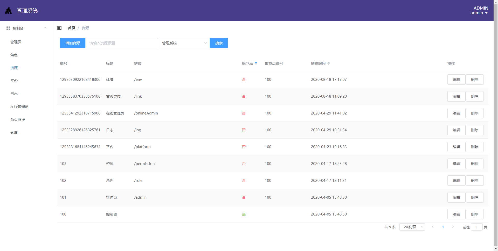
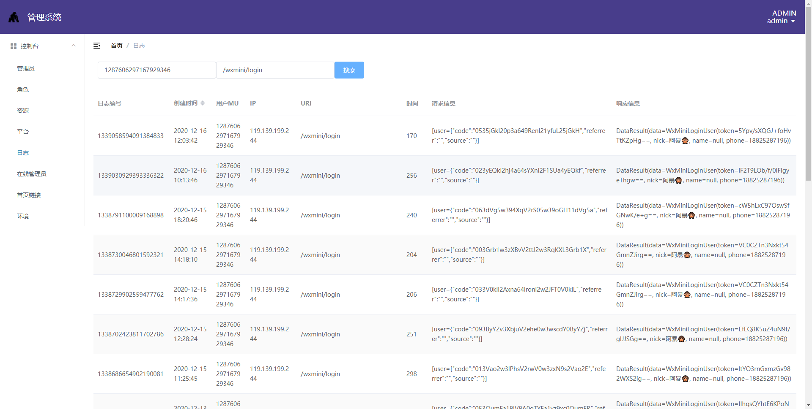
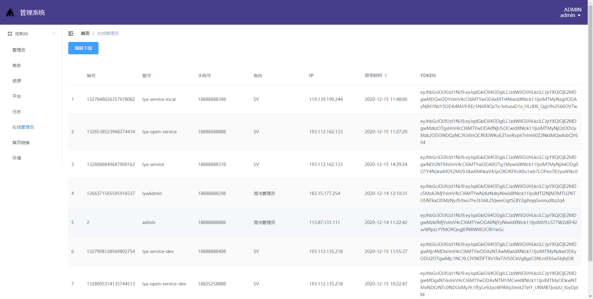
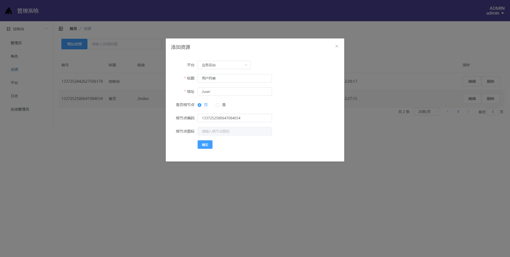
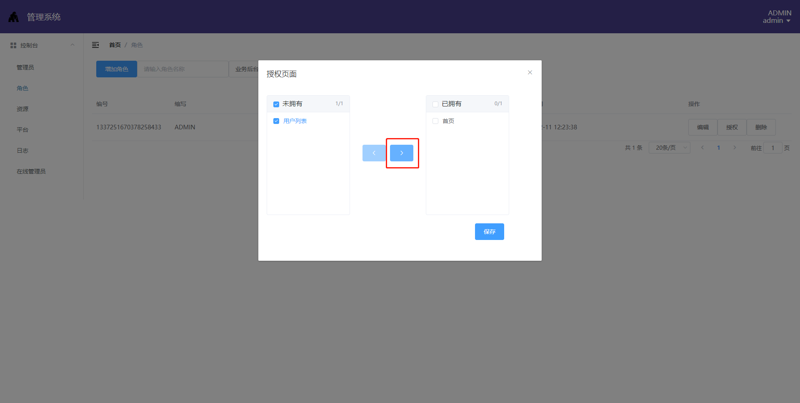
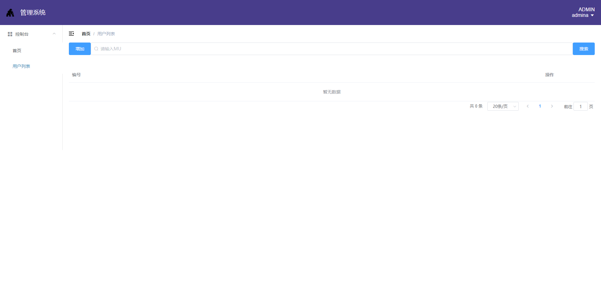

#   CHAOS
    快速开发架构，一键生成，快速开发！！！ 
##  [点击查看](https://gitee.com/ape-stack/chaos/blob/master/code.md)代码生成示例

#   架构介绍
    chaos是一个前后端分离的分布式微服务架构。
    chaos架构由服务端架构chaos-cloud、中后台架构chaos-vue/chaos-umi，微信原生小程序架构chaos-weapp组成。   

##  技术栈
| 架构        | 框架                              | 版本          |
| ---------- | --------------------------------- | ------------- |
| chaos-cloud | 基于springcloud的服务端架构        | 3.0.0         |
|             | SpringCloudAlibaba                | 2.2.1.RELEASE |
|             | dubbo                             |               |
|             | nacos                             |               |
|             | MybatisPlus                       |               |
| chaos-vue   | 基于vue的中后台架构         | 1.0.0         |
|             | vue                               | 2.6.12        |
|             | vuex                              | 3.6.2         |
|             | ElementUI                         | 2.15.1        |
|             | axios                             |               |
| chaos-umi   | 基于react的中后台架构       | 1.0.0         |
|             | react                             | 16.8.6        |
|             | umi                               | 3.2.14        |
|             | AntDesignPro                      | v4            |
| chaos-weapp | 微信原生小程序架构                |               |
|             | vant                              |               |

##  模块
    chaos
    ├── chaos-cloud-base -- 基于SpringCloud的服务端架构实现
         ├── chaos-cloud-dependencies -- 包依赖定义
         ├── chaos-cloud-parent -- maven parent
         ├── chaos-cloud-app -- 数据层业务定义
         ├── chaos-cloud-web -- 协议层业务定义
         ├── chaos-cloud-admin -- 管理系统实现
         ├── chaos-cloud-ws -- 集成websocket 
         ├── chaos-cloud-search -- 集成elasticSearch
         ├── chaos-cloud-code -- 代码生成工具实现                           
    ├── chaos-cloud -- 服务端
         ├── chaos-model -- 实体定义模块
         ├── chaos-service -- 服务模块[8899]
         ├── chaos-manage -- 后台服务模块[38899]
         ├── chaos-client -- 客户端服务模块[58899]
    ├── chaos-admin -- 管理系统
         ├── chaos-admin-service -- 实体定义模块[38089]
         ├── chaos-admin-back -- 管理后台[8080]    
    └── chaos-vue  -- 后台[8080] 
    └── chaos-umi  -- 后台[8080] 
    └── chaos-weapp  -- 微信小程序
    └── chaos-ops -- 运维

#   快速开始
    本架构面向于全栈开发，使用前需要了解以下知识
    1.IDEA、vscode、git、lombook   
    2.maven、npm  
    3.linux、docker   
    4.mysql、redis、nacos

##  环境搭建
    1.搭建开发环境（windows）
      执行chaos-ops下startup.cmd
    2.启动mysql、nacos、redis   
##  服务启动      
    1.启动chaos-admin-service（管理系统后台服务）
    2.启动chaos-admin-back（管理系统）
      访问127.0.0.1:8080；默认账号密码（admin/admin123）   
    3.启动chaos-service
    4.启动chaos-manage
    5.启动chaos-vue/chaos-umi  
      访问127.0.0.1:8080可访问管理后台，默认账号密码（admina/admin123）（同时启动需要注意端口！）
    6.启动chaos-client
    7.启动chaos-weapp（原生微信小程序）
    8.启动？

## 功能截图

      
##  代码生成工具使用
    1.完成数据库设计，遵循MuModel约定
    2.使用代码生成器chaos-cloud-code生成服务端代码
    3.使用npm run tep user生成前端页面代码

##  生产部署
    脚本目录:/chaos/chaos-ops/deploy/
    docker-compose.yml 安装redis，nacos，nginx
    nginx.conf 默认nginx配置

#   设计理念 
##  后端的设计和规范  
    1.数据库使用mysql。   
    2.数据库表默认需要id、mu、create_time，modify_time，is_delete，version字段。   
    3.服务端代码结构包括：model（实体和接口定义），service（服务实现），manage（后台接口），client（客户端接口）。  
    4.实体定义：MuModel对应数据库表结构、Data对应协议结构。   
    5.服务间提供dubbo、feign两种调用方式。    
    6.service处理事务，包括本地事务和分布式事务。  
    7.web层默认提供Restful服务（只使用post），manage服务提供add，delete，update，one，list，page；
      client提供提供one，list，page。   
    8.对于基础业务可以通过chaos-cloud-code代码快速生成。  

##  前端的设计和规范  
    1.前端fetch处理协议级业务，包括http code逻辑，token逻辑，lastPost逻辑。  
    2.提供Data.js处理后端服务接口包括（add，remove，update，one，list，page）和（search，query，submit）。    
    3.使用vuex处理全局数据，提供admin，app，data模块。    
    4.使用mixin，提供page，curd，pushpage，pushcrud。
    5.对于通用页面可以通过npm run tmp创建。

# 联系我们

    QQ群：1067845715 

# Poweredby 阿暴@[火猩科技](https://firepongo.gitee.io/)
